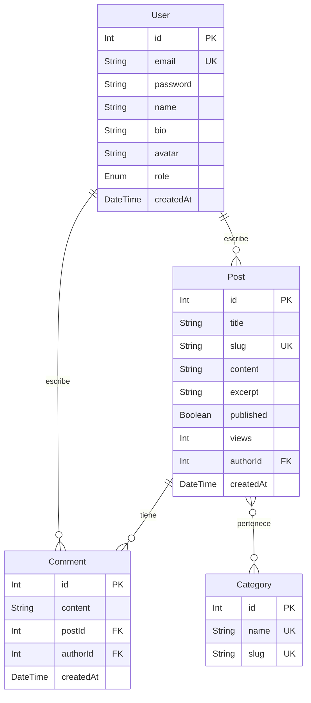

# Blog API con Prisma 7

Una API RESTful robusta para un sistema de blogs, construida con Node.js, Express y Prisma ORM (v7). Utiliza SQLite como base de datos por defecto para facilitar el desarrollo local.

## 🚀 Características

- Gestión de **Usuarios** (Bio, Avatar, Roles).
- Gestión de **Posts** (Slug automático, Vistas, Categorías, Comentarios).
- Sistema de **Comentarios**.
- Clasificación por **Categorías**.
- Paginación y Filtrado en endpoints de listado.
- Arquitectura escalable con TypeScript.

## 🛠️ Requisitos Previos

- [Node.js](https://nodejs.org/) (v18 o superior recomendado)
- [npm](https://www.npmjs.com/)

## 📦 Instalación

1. Clona el repositorio:

   ```bash
   git clone <url-del-repositorio>
   cd blog-api
   ```

2. Instala las dependencias:

   ```bash
   npm install
   ```

3. Configura las variables de entorno:
   - El archivo `.env` ya viene preconfigurado con:
     ```env
     DATABASE_URL="file:./dev.db"
     SERVER_PORT=3000
     ```

4. Ejecuta las migraciones de Prisma y genera el cliente:

   ```bash
   npx prisma migrate dev --name init
   npx prisma generate
   ```

5. (Opcional) Carga datos de prueba:
   ```bash
   npm run seed
   ```

## 🏃 Scripts Disponibles

- `npm run dev`: Inicia el servidor en modo desarrollo con `tsx watch`.
- `npm start`: Inicia el servidor en modo producción.
- `npm run build`: Compila el proyecto TypeScript a JavaScript.
- `npm run seed`: Ejecuta el script de seeding de la base de datos.

## 🛣️ API Endpoints

### Usuarios (/api/users)

- `GET /api/users`: Listar todos los usuarios.
- `GET /api/users/:id`: Obtener detalles de un usuario específico (incluye sus posts publicados).

### Posts (/api/posts)

- `GET /api/posts`: Listar posts (soporta query params `page`, `limit`, `published`).
- `GET /api/posts/:slug`: Obtener un post por su slug (incrementa el contador de vistas).
- `POST /api/posts`: Crear un nuevo post.
- `PUT /api/posts/:id`: Actualizar un post existente.
- `DELETE /api/posts/:id`: Eliminar un post.

## 📊 Modelo de Datos



## 📄 Licencia

ISC
-prisma
